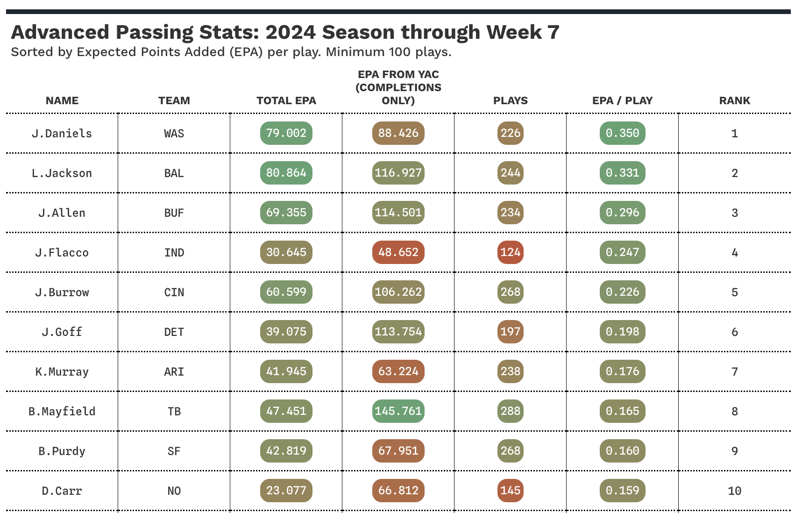

# NFL Analytics 

In this repo, I'll explore the `nflverse::` packages along with a variety of data sources. Any analysis within will have a bias toward the Pittsburgh Steelers.

| File | Description |
|------|-------------|
| [draft_picks.Rmd](draft_picks.Rmd) | Initial (limited) exploration of the data available from `load_draft_picks()` and `load_combine()` functions. |
| [epa.Rmd](epa.Rmd) | Exploration of the Expected Points Added metric as the 2024 season unfolds. |
| [next_gen.Rmd](next_gen.Rmd) | Exploration of NFL Next Gen Stats and Pro Football Reference data, borrowing heavily from Brad Congelio's book, [Introduction to NFL Analytics with R](https://bradcongelio.com/nfl-analytics-with-r-book/). |
| [personnel_groupings.Rmd](personnel_groupings.Rmd) | Initial exploration of snap count and personnel grouping data. |
| [top_plays.Rmd](top_plays.Rmd) | Explores the top plays from prior games, in terms of EPA and win probability, a la [Unexpected Points](https://www.unexpectedpoints.com/). |
| [understanding_nflverse.Rmd](understanding_nflverse.Rmd) | Explores the `nflreadr::` package with the help of Brad Congelio's book, [Introduction to NFL Analytics with R](https://bradcongelio.com/nfl-analytics-with-r-book/). |
| [unexpected_points.Rmd](unexpected_points.Rmd) | Explores some of the data and attempts to replicate/understand the metrics used in the [Unexpected Points Substack](https://www.unexpectedpoints.com/). |
| [receiver_tracking_metrics_espn.Rmd](receiver_tracking_metrics_espn.Rmd) | Scrapes the [ESPN Analytics](https://espnanalytics.com/receivers) site and explores the Receiver Tracking Metrics, including receiver ratings like Open Score, Catch Score, and YAC score. |

